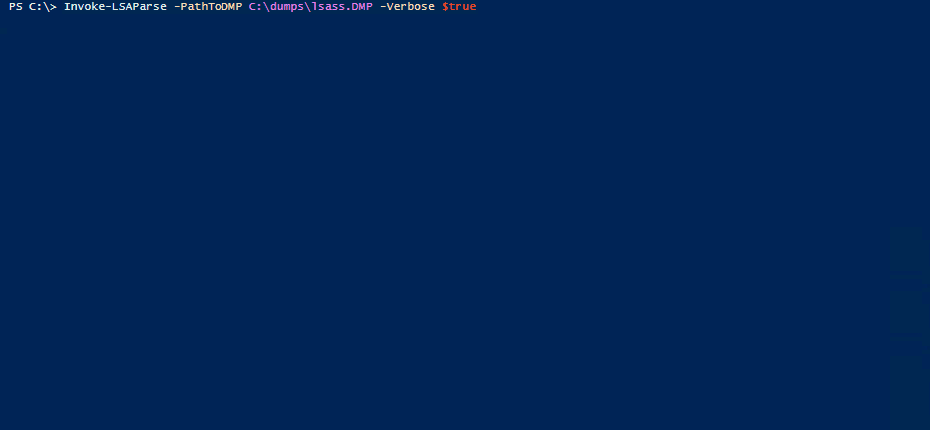

# Invoke-LSAParse

PowerShell implementation for parsing LSA (Local Security Authority) memory dumps.

This PowerShell script can be used to extract user credentials (currently only NT hashes) from LSA memory dump files. Its only dependency is the executable of the [Microsoft Console Debugger (cdb.exe)](https://docs.microsoft.com/en-us/windows-hardware/drivers/debugger/debugger-download-tools) which is integrated into the PowerShell code by using the corresponding build script.

A tech blog article titled [Extracting Secrets from LSA by Use of PowerShell](https://blog.syss.com/posts/powershell-lsa-parsing/) about the problem of parsing LSA process memory dumps can be found on the [SySS Tech Blog](https://blog.syss.com/).

## Installation

1. Download Invoke-LSAParse
1. Download the [Microsoft Console Debugger](https://docs.microsoft.com/en-us/windows-hardware/drivers/debugger/debugger-download-tools) and copy the executable file `cdb.exe` to the `Invoke-LSAParse` directory
1. Call the PowerShell build script `.\build.ps1` to create the actual `Invoke-LSAParse.ps1` PowerShell script

## Usage

Load the module `Invoke-LSAParse` in a PowerShell session, e.g. via `Import-Module .\Invoke-LSAParse.ps1`, and execute it using the two parameters `PathToDMP` (absolute path of LSA dump file) and `verbose` (show additional information).

## Mode of operation

`Invoke-LSAParse` writes the executable `cdb.exe` of the Microsoft Console Debugger in the temporary directory of the current user. The Microsoft Console Debugger is used for retrieving the exact memory addresses within dump files.

After those memory addresses are known, the data structures containing cryptographic data and encrypted user credentials are parsed using PowerShell code.

Currently, `Invoke-LSAParse` only outputs the NT hashes of logged-in users or identities.

## Limitations

The current version of `Invoke-LSAParse` has the following limitations:

* Only Windows 10 LSASS process memory dumps are reliably supported.
* Extracting cleartext passwords is currently not supported.

## Author
Sebastian Hölzle, SySS GmbH, 2021

## Disclaimer

Use at your own risk. Do not use without full consent of everyone involved.
For educational purposes only.

